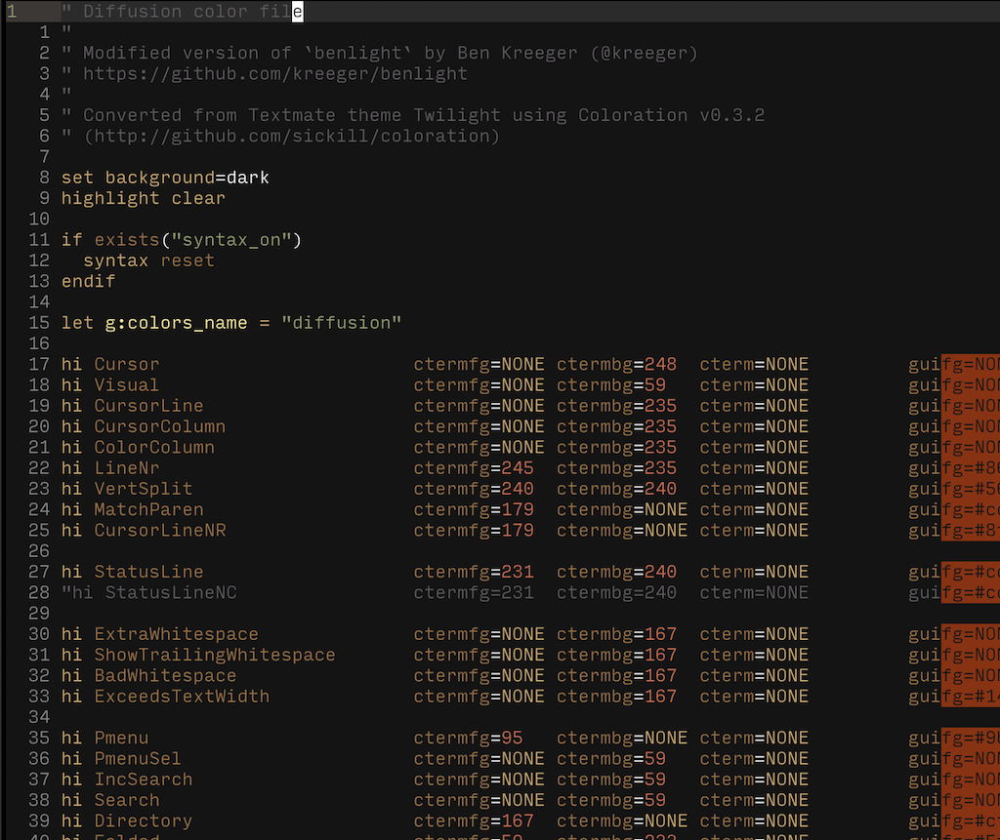

# Diffusion

Twilight:
> "the light from the sky between full night and sunrise or between sunset and full night produced by **diffusion** of sunlight through the atmosphere and its dust"

Diffusion is a modified version of @kreeger's [benlight](https://github.com/kreeger/benlight) color scheme, which is a modified version of Twilight.

Diffusion has the following changes:
  * Adds color for `Error`
  * Adds color for various trailing whitespace labels
  * Adjusts the number color colors to have a matching scheme with relative line numbers.
  * Aligns attributes.

```
Plugin 'anmull/diffusion.vim'
```

<p style="text-align:center"></p>
